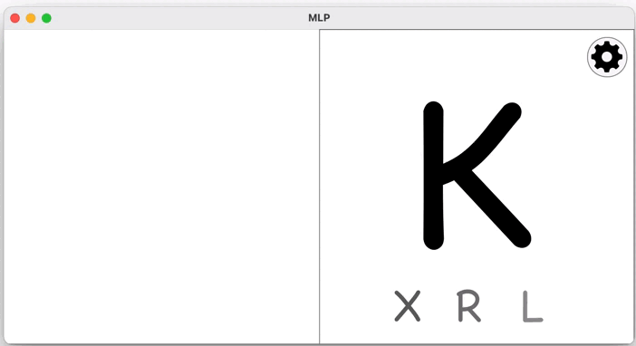

# Multilayer Perceptron

Проект MultilayerPerceptron (многослойный перцептрон):

- Программа предоставляет возможность формировать и обучать модели нейронных сетей для классификации рукописных букв латинского алфавита
- Перцептрон реализован двумя способами:
  - в матричном виде
  - в графовом виде

- Перцептрон имеет возможность:
  - классифицировать BMP-изображения с рукописными буквами латинского алфавита
  - выбирать от 2 до 5 скрытых слоев
  - обучаться на открытом датасете (директории datasets) в реальном времени
  - подгружать обученные "веса" (точность на тестовой выборке 79-82%)
  - сохранять в файл и загружать из файла веса перцептрона

Интерфейс программы реализован на базе QT.

Проект разработан совместно с:

https://github.com/OlegDeLon

https://github.com/Ic1k

